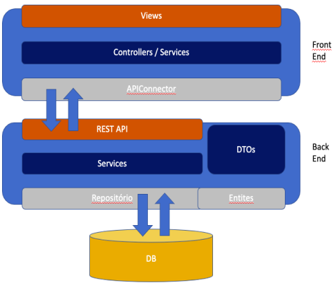
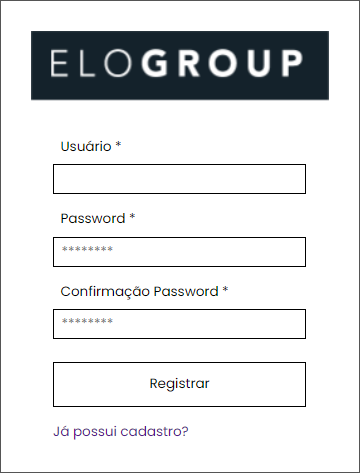
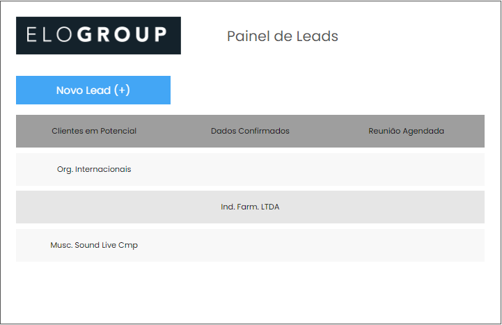
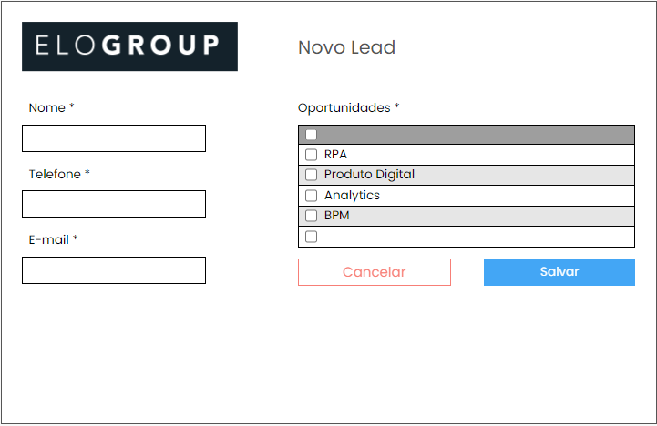

<h1 align="center">EloGroup Challenge</h1>

  <a href="#-project">Project</a>&nbsp;&nbsp;&nbsp;|&nbsp;&nbsp;&nbsp;
  <a href="#-layout">Layout</a>&nbsp;&nbsp;&nbsp;|&nbsp;&nbsp;&nbsp;
  <a href="#-how-to-run">How to run</a>

## 💻 Project

Desafio Técnico da EloGroup para vaga de Desenvolvedor Jr: fazer um painel para manuntenção de leads.

## 🔖 Layout

<h2>- Arquitetura</h2>

 

<h2>- Registro</h2>

 

<h2>- Painel de Leads</h2>

 

<h2>- Criação de Leads</h2>

 

## 🚀 How to run

Abra o arquivo "login.html"

---

Made with ♥ by Felipe